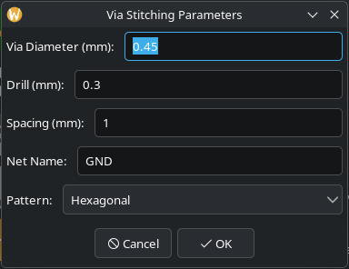
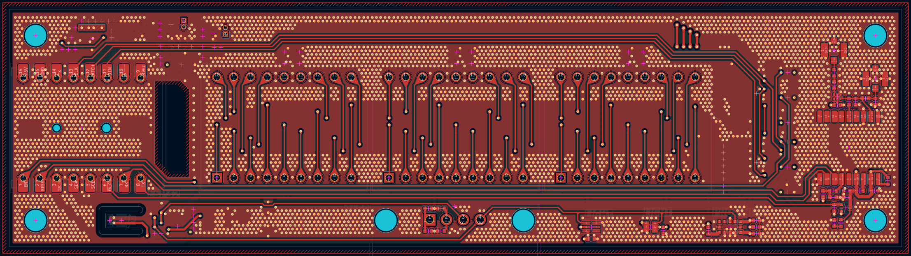

# ViaStitching — KiCad 10 Plugin

A KiCad action plugin that fills copper zones with stitching vias for a chosen net.  
Useful for improving GND plane integrity, shielding, and thermal dissipation.

---

## Features

- Fills any copper zone with stitching vias for a selected net
- **Three placement patterns**: Square, Staggered, Hexagonal (hex close-pack)
- Full DRC-aware collision detection:
  - Reads the board minimum clearance from design rules automatically — the dialog pre-fills the **Min Clearance** field with the board value and enforces it as a floor even if a lower value is entered
  - Respects per-net-class clearances for different-net tracks and vias
  - Enforces clearance against all tracks, pads, and vias — same-net and different-net
  - Prevents via copper from overlapping same-net pad copper (previously only blocked positions strictly inside the raw pad bounding box)
  - Separate drill-to-hole distance check for through-hole and NPTH pads, using the board hole-to-hole clearance rule, so stitching vias never merge their drill holes with pad holes
  - Respects keepout zones and rule areas
  - Respects board edge clearance
- Interactive dialog populated with nets from the live board
- Vias are grouped for easy bulk selection and deletion

---

## Screenshots

 

---

## Installation

### Manual (all platforms)

1. Download or clone this repository
2. Copy the `ViaStitching` folder into your KiCad plugins directory:

| OS | Path |
|---|---|
| Linux | `~/.local/share/kicad/10.0/3rdparty/plugins/` |
| Windows | `%APPDATA%\kicad\10.0\3rdparty\plugins\` |
| macOS | `~/Library/Preferences/kicad/10.0/3rdparty/plugins/` |

3. In KiCad PCB Editor: **Tools → External Plugins → Refresh Plugins**

The plugin will appear under **Tools → External Plugins → Via Stitching Tool**.

---

## Usage

1. Open your `.kicad_pcb` file in the PCB Editor
2. **Fill all zones first** (`B` key) so the plugin can read zone outlines
3. Run **Tools → External Plugins → Via Stitching Tool**
4. Set the parameters in the dialog and click OK
5. After placement, **fill zones again** (`B` key) to connect the new vias

### Parameters

| Parameter | Description | Typical value |
|---|---|---|
| Via Diameter | Outer copper diameter of the via | 0.6 mm |
| Drill | Drill hole size | 0.3 mm |
| Spacing | Centre-to-centre distance between vias | 1.0 – 2.54 mm |
| Min Clearance | Minimum edge-to-edge gap between via copper and any other copper. Pre-filled from the board's design-rule minimum; cannot go below the board rule at runtime. | from board rules |
| Net Name | The net to stitch (dropdown lists all board nets) | GND |
| Pattern | Grid arrangement (see below) | Hexagonal |

### Placement patterns

| Pattern | Description |
|---|---|
| **Square** | Regular grid — vias at equal X and Y intervals |
| **Staggered** | Alternating rows are offset by spacing/2 — "brick wall" layout |
| **Hexagonal** | Staggered rows with Y spacing compressed by √3/2 ≈ 0.866 — true hexagonal close-packing, most uniform coverage |

### Deleting generated vias

All vias placed by the plugin are collected into a named group (`ViaStitching <netname>`).  
To remove them:
1. Click any generated via to select the group
2. Press `Delete`

---

## Requirements

- KiCad 10.0 or later
- Python 3 (bundled with KiCad)

---

## License

GPL-3.0-or-later — see [LICENSE](LICENSE).

Original work by [JS Reynaud](https://github.com/jsreynaud/kicad-action-scripts).  
KiCad 10 port and improvements by Daniel Stelian Dobre.
